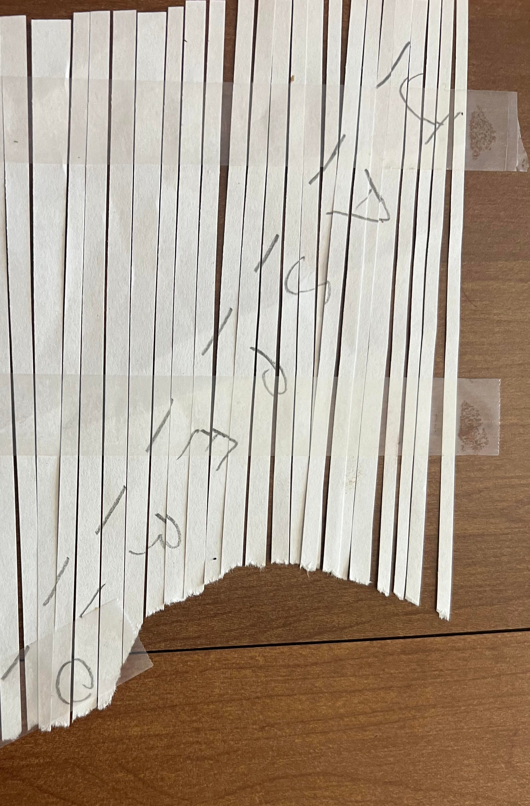
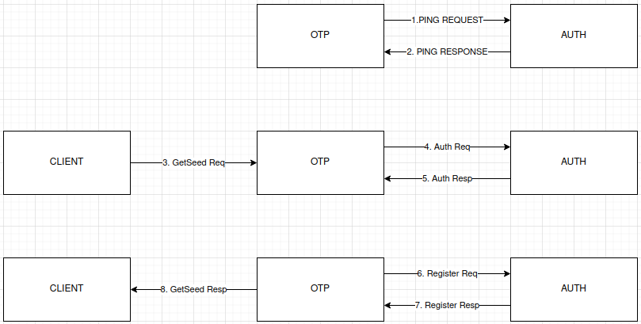
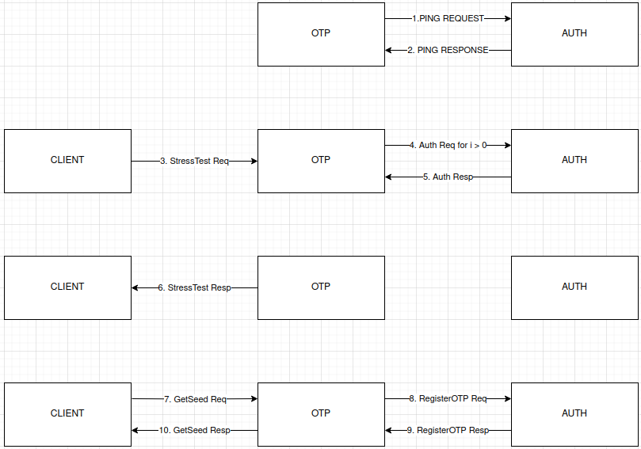

<!-- Sidebar Table of Contents -->
<nav id="sidebar">
    <h2>Table of Contents</h2>
    <ul>
        <li><a href="##before-you-read">Background Information</a></li>
        <li><a href="#task-0---community-of-practice-discord-server">Task 0</a></li>
        <li><a href="#task-1---no-token-left-behind">Task 1 - No Token Left Behind</a></li>
        <li><a href="#task-2---driving-me-crazy">Task 2 - Driving Me Crazy</a></li>
        <li><a href="#task-3---how-did-they-get-in">Task 3 - How did they get in?</a></li>
        <li><a href="#task-4---llms-never-lie">Task 4 - LLMs never lie</a></li>
        <li><a href="#task-5---the-153">Task 5 - The #153</a></li>
        <li><a href="#conclusion">Conclusion</a></li>
    </ul>
</nav>

# Before you read

Here I just wanted to give some background information on me and this challenge. This is a challenge developed by the National Security Agency that takes place over several months and tests various technical and logical skills. Out of any CTF challenge I've done, this has been my favorite by far. Here I'm just going to talk about how I solved these challenges, some other methods to solve them, and some of my mistakes along the way. 

## Task 0 - (Community of Practice, Discord Server):

'''  
As a participant in the Codebreaker Challenge, you are invited to join the New Mexico Tech Codebreaker Challenge Community of Practice! This is the 3rd year that NMT has partnered with the NSA Codebreaker Challenge. Its purpose remains to give students interested in cybersecurity a place to talk about Codebreaker, cybersecurity, and other related topics.

To complete this task, first, join the Discord server.

Once there, type /task0 in the #bot-commands channel. Follow the prompts and paste the answer the bot gives you below.

'''

There really isn't much to say about task 0. We were given a Discord Channel to join. From there we just had to enter the /task0 command and supply our email and a token to validate ourselves. Really set the tone for the rest of the challenge.

## Task 1 - No Token Left Behind:

'''  
Aaliyah is showing you how Intelligence Analysts work. She pulls up a piece of intelligence she thought was interesting. It shows that APTs are interested in acquiring hardware tokens used for accessing DIB networks. Those are generally controlled items, how could the APT get a hold of one of those?

DoD sometimes sends copies of procurement records for controlled items to the NSA for analysis. Aaliyah pulls up the records but realizes it’s in a file format she’s not familiar with. Can you help her look for anything suspicious?

If DIB companies are being actively targeted by an adversary the NSA needs to know about it so they can help mitigate the threat.

Help Aaliyah determine the outlying activity in the dataset given  
'''

For this task, we were given a file, _**shipping.db**_, which is a compressed directory containing DoD procurement information. The one file is important to us is _**content.xml**_. This is an xml database that contains various information and procurement ID's for every purchase.

An example Entry:

<text:p>&lt;text:p&gt;Titan Aerospace Systems&lt;/text:p&gt;&lt;/table:table-cell&gt;&lt;table:table-cell office:value-type="string" calcext:value-type="string"&gt;&lt;text:p&gt;316 Hawkins Isle Apt. 275, New Steveland, AR 73351&lt;/text:p&gt;&lt;/table:table-cell&gt;&lt;table:table-cell office:value-type="string" calcext:value-type="string"&gt;&lt;text:p&gt;Jessica Thomas&lt;/text:p&gt;&lt;/table:table-cell&gt;&lt;table:table-cell office:value-type="string" calcext:value-type="string"&gt;&lt;text:p&gt;###-###-4680&lt;/text:p&gt;&lt;/table:table-cell&gt;&lt;table:table-cell office:value-type="string" calcext:value-type="string"&gt;&lt;text:p&gt;jessicat@titanaerospace.systems&lt;/text:p&gt;&lt;/table:table-cell&gt;&lt;table:table-cell office:value-type="string" calcext:value-type="string"&gt;&lt;text:p&gt;Ryan Perez&lt;/text:p&gt;&lt;/table:table-cell&gt;&lt;table:table-cell office:value-type="string" calcext:value-type="string"&gt;&lt;text:p&gt;###-###-9665&lt;/text:p&gt;&lt;/table:table-cell&gt;&lt;table:table-cell office:value-type="string" calcext:value-type="string"&gt;&lt;text:p&gt;ryanp@titanaerospace.systems&lt;/text:p&gt;&lt;/table:table-cell&gt;&lt;table:table-cell office:value-type="string" calcext:value-type="string"&gt;&lt;text:p&gt;TIT0672027&lt;/text:p&gt;

I decided to just open this up in an XML database application, **basex**. From here, I started to look through the database properties where I could see the frequency of each item in the database. I figured that if an entry was poisoned, it would only appear once (expect for the procurement IDs), so I started by looking at all of the unique entries. Here I found that there was an address that was only used once. And after finding it in the database, I also had the procurement ID associated with that purchase. 

This was of course the easiest task in the challenge, but I had not worked much with xml and don't plan to work with it much anymore. But, it was interesting nontheless. Also, I have a feeling my solution to this task contributed to my difficulty with finding out what 'jasper_0' was in task3. Had I actually looked at an entry, I would have seen a very similar layout for all of the emails and this could have sped up that last little bit. 

## Task 2 - Driving Me Crazy:

'''  
Having contacted the NSA liaison at the FBI, you learn that a facility at this address is already on a FBI watchlist for suspected criminal activity.

With this tip, the FBI acquires a warrant and raids the location.

Inside they find the empty boxes of programmable OTP tokens, but the location appears to be abandoned. We're concerned about what this APT is up to! These hardware tokens are used to secure networks used by Defense Industrial Base companies that produce critical military hardware.

The FBI sends the NSA a cache of other equipment found at the site. It is quickly assigned to an NSA forensics team. Your friend Barry enrolled in the Intrusion Analyst Skill Development Program and is touring with that team, so you message him to get the scoop. Barry tells you that a bunch of hard drives came back with the equipment, but most appear to be securely wiped. He managed to find a drive containing what might be some backups that they forgot to destroy, though he doesn't immediately recognize the data. Eager to help, you ask him to send you a zip containing a copy of the supposed backup files so that you can take a look at it.

If we could recover files from the drives, it might tell us what the APT is up to. Provide a list of unique SHA256 hashes of all files you were able to find from the backups. Example (2 unique hashes):

  471dce655395b5b971650ca2d9494a37468b1d4cb7b3569c200073d3b384c5a4
  0122c70e2f7e9cbfca3b5a02682c96edb123a2c2ba780a385b54d0440f27a1f6  
'''

For this task, we were given an archive of backup files that could help us find out what this APT is up to. Immediately things did not go so well for me on this task and really just wouldn't :(. I extracted the backup files and ran the file command on the first backup. This let me know that these were <a href="https://docs.oracle.com/cd/E19253-01/819-5461/gbcya/index.html" target="_blank">*zfs snapshots*</a>. From here, I went down a massive rabbit hole. I installed a FreeBSD virtual machine and installed a second virtual harddrive onto it so I could create a zpool and perform an incremental zfs recieve on the backups. Then I tried various ways to try and make this zfs receive work. This all despite knowing that this was a broken zfs stream meaning that I would never be able to receieve all of the snapshots. despite my best attempts, I could not make something efficient to make this work. So, I went through the incredibly tedious copy and pasting plaintext into a file and hashing it. Becuase of this, I got stuck on the last hash. This is where I used my first _get-help_. In traditional fashion, I got the "Keep thinking" message that seems to have become synonymous with this challenege. 

But, aftering thinking for a bit, I remembered that there was a file called _**config.edn**_ which was actually empty and therefore never had data that showed up in any of the backup files. So, I decided to create an empty file and hash that. To my surprise and mild annoyance, it worked. 

I almost forgot to mention that during my thinking stage at the end, I went down a couple weird rabbit holes where I found the logseq application hashes from when these files would have been created and tried several of those. This still sticks with me... 

## Task 3 - How did they get in?:

'''  
 Great work finding those files! Barry shares the files you extracted with the blue team who share it back to Aaliyah and her team. As a first step, she ran strings across all the files found and noticed a reference to a known DIB, “Guardian Armaments” She begins connecting some dots and wonders if there is a connection between the software and the hardware tokens. But what is it used for and is there a viable threat to Guardian Armaments (GA)?

She knows the Malware Reverse Engineers are experts at taking software apart and figuring out what it's doing. Aaliyah reaches out to them and keeps you in the loop. Looking at the email, you realize your friend Ceylan is touring on that team! She is on her first tour of the Computer Network Operations Development Program

Barry opens up a group chat with three of you. He wants to see the outcome of the work you two have already contributed to. Ceylan shares her screen with you as she begins to reverse the software. You and Barry grab some coffee and knuckle down to help.

Figure out how the APT would use this software to their benefit  
'''

If you ask anyone in this challenge, task 3 was the hardest. I'm inclined to agree with them. The only reverse-engineering experience I had prior to this task was reading source-code to understand what it did. I had never actually tried to reverse-engineer a binary before, but did know of *Ghidra* and *IDA* and had read some article about reverse-engineering. So... this was quite hard as you can imagine.

In this challenge, we were given an executable from the zfs filesystem and an image of a shredded page that read "*jasper_0*". I started by doing the typical _file_ and _strings_ command on the executable.

server: ELF 64-bit LSB executable, x86-64, version 1 (SYSV), dynamically linked, interpreter /lib64/ld-linux-x86-64.so.2, Go BuildID=W52wkW82l-QqCNkZlrWN/uPwKeKb7-L-DMg0w7fI9/9q7G13AkdWBvnvqzUcbZ/8urZRFTaPdWcrHAQMU3e, with debug_info, not stripped

*Not stripped?? It seemed like my lucky day at the time*

After reading some of the output from the _strings_ command, I decided to open this up in *Ghidra* and *IDA* to start actually reading some of the pseudo-code. 

A snippet from the filesystem backups, an <a href="https://cujo.com/blog/reverse-engineering-go-binaries-with-ghidra/" target="_blank">article</a> I read about a year prior, and the _strings_ output helped me to narrow down that this was a go binary pretty quickely. These resources also helped to get me moving in the right direction with my analysis. I decided to try and see what the program did from the users perspective, so I ran the binary and saw some important information:

<text:p>
Starting the Guardian Armaments OTP seed generation service!  Please ensure that this software can reach the authentication service to register any generated seeds!  Otherwise your token will not authenticate you to the network after you program it with this seed

{"time":"2025-01-28T16:21:05.586487229-05:00","level":"INFO","msg":"Connected to auth server"}
{"time":"2025-01-28T16:21:05.58684643-05:00","level":"ERROR","msg":"Failed to ping the auth service","ping_response":null,"err":"rpc error: code = Unavailable desc = connection error: desc = \"transport: Error while dialing: dial tcp 127.0.0.1:50052: connect: connection refused\""}

This shows the binary is an OTP seed generator for an internal DIB network and that it was trying to ping an authentication server running on 127.0.0.1:50052. For anyone who doesnt know, and OTP seed generator is a program that generates seeds that an authentication server and a client can use to produce One Time Passwords (OTPs). It is implied by the procurment of the hardware tokens that this OTP seed would be programmed into the hardware token and the hardware token would provide internal network access. 

So my first though was to just use netcat to listen for communication on that port. The results from this indicated that this OTP seed generator is communicating with HTTP/2. 

nc -lvnp 50052 

Connection from 127.0.0.1:44272
PRI * HTTP/2.0

HTTP/2, while being significantly better, is not used nearly as much as HTTP/1.1 allowing us to narrow down our analysis. With the strings, functions, HTTP/2, and some googling in mind, I found that the binary was using the <a href="https://grpc.io/docs/what-is-grpc/introduction/" target="_blank">gRPC framework</a> for communication. gRPC (Remote Procedure Call) is similar to a REST API. gRPC works on something like a contract model. The client and server program use a proto file to define functions, arguments, and data types that can be passed back and forth. 

<text:p>syntax = "proto3";

package seed_generation;

service SeedGenerationService {
  rpc GetSeed(SeedRequest) returns (SeedResponse);
  rpc StressTest(StressTestRequest) returns (StressTestResponse);
}

// The message sent from the client to the server
message SeedRequest {
  // A parameter that influences the seed generation (you can add more fields)
  string username = 1;
  string password = 2;
}

// The message returned from the server to the client
message SeedResponse {
  // The generated seed
  int64 seed_value = 1;
  int64 count = 2;
}

message StressTestRequest {
  int64 Count = 1;
  string username = 2;
  string password = 3;
}

message StressTestResponse {
  int64 response = 1;
  string count = 2;
}

A client sends a request as specified in the shared proto file to the server. The server will do whatever processing it needs to do and return data to the client as specified in the shared proto file. We are able to pretty quickely confirm this with the ping function in the binary. So, my first step was to get the authentication server up and running. I decided to use python for this because it would be significnatly easier than using *golang* considering I've never used *go* before. I was able to get the authentication server up and running pretty quickely and could receive and respond to a ping request!! 

<text:p>import grpc
import socket  
import sys
from concurrent import futures
import auth_service_pb2
import auth_service_pb2_grpc
import numpy as np

class AuthService(auth_service_pb2_grpc.AuthServiceServicer):

    def Ping(self, request, context):
        try:
            responseinteger = np.int64(456)
            print(f"Received Ping request with message: {request.message}")
            response = auth_service_pb2.PingResponse(message = 456)
            if response:
                print(f"Successfully sent response: {response}")

            return response
        except Exception as e:
            print(f"Error in Ping handler: {e}")
            context.set_details(f"Error in service handler: {str(e)}")
            context.set_code(grpc.StatusCode.INTERNAL)
            return auth_service_pb2.PingResponse()

    def Authenticate(self, request, context):
        try:
            print(f"\nReceived Authentication Request: \nUsername: \"{request.username}\", Password: \"{request.password}\"")
            print(context)
            if request.username == "user" or request.username == None:
                response = auth_service_pb2.AuthResponse(is_valid=False, message="Username and password is not valid")
                print(f"Sending Auth Response: {response}")
                return response
            response = auth_service_pb2.AuthResponse(is_valid=True, message="Username and password is valid")
            print(f"Sending Auth Response: {response}")
            return response
        except Exception as e:
            print(f"Error in Credential handling: {e}")
            context.set_details(f"Error in service handler: {str(e)}")
            context.set_code(grpc.StatusCode.INTERNAL)

    def RegisterOTPSeed(self, request, context):
        try:
            print(f"\nReceived OTP register request: \nuser_id: \"{request.user_id}\", seed: \"{request.seed}\", state: \"{request.count}\"")
            if request.count:
                sys.exit(0)
            print(context)

            response = auth_service_pb2.OTPSeedResponse(is_valid = True)
            if response is None:
                print("response is null")
            print(f"Sending OTP registeration response: {response}")
            return response

        except Exception as e:
            print(f"Error in seed handling: {e}")
            context.set_details(f"Error in service handler: {str(e)}")
            context.set_code(grpc.StatusCode.INTERNAL)

    def FunctionStream(self, request_iterator, context):
        request = [
            auth_service_pb2.FunctionRequest(request_type="RefreshToken", payload = "1"),
            auth_service_pb2.FunctionRequest(request_type="VerifyOTP", payload = "2455094387035389244")
        ]
        for req in request:
            print(f"Sending request: {req}")
            yield req

            try:
                response = next(request_iterator)
                print(f"Response: {response.result}, Status: {response.status}")
            except Exception as e:
                print(f"Error in sending reqeust: {e}")
  
    def Logout(self, request, context):
        try:
            #print(f"Received OTP Authentication Token: {seed}")
            #print(f"user_id: {request.user_id}")
            print("Received Logout request")
            new_token = 2455094387035389245
            response = auth_service_pb2.LogoutResponse(success=True, message="Successfully logged out")
            print(f"Sending logout response: {response}")
            return response
        except Exception as e:
            print(f"Error in Token handling: {e}")
            context.set_details(f"Error in service handler: {str(e)}")
            context.set_code(grpc.StatusCode.INTERNAL)

def serve():
    server = grpc.server(futures.ThreadPoolExecutor(max_workers=10))
    auth_service_pb2_grpc.add_AuthServiceServicer_to_server(AuthService(), server)
    server.add_insecure_port('[::]:50052')
    server.start()
    print("gRPC server listening on port 50052...")
    server.wait_for_termination()

if __name__ == '__main__':
    serve()

*This was just the final iteration of my program, I did start with just the 'ping' function implimented and slowely implimented all of the other functions to ensure they worked appropriately*

Ok so now what?? Well the other functions in the OTP seed binary indicate that a client program is needed to actually make the requests to generate the seeds. So, lets get a client program working. After some bashing my head against the wall, I was finally able to get the client program to prompt the OTP seed binary to generate a seed. 

<text:p>import grpc
import sys
import seedgen_service_pb2
import seedgen_service_pb2_grpc

def main(FunctionCall):

    bState = True
    SeedGenStub, AuthStub = ConnectToServer()

    while bState:
        if FunctionCall == "seed":
            GetAuthSeed(SeedGenStub)
        elif FunctionCall == "test":
            StressTestServer(SeedGenStub)
        elif FunctionCall == "ping":
            PingServer(SeedGenStub)
        elif FunctionCall == "verify":
            VerifyOTP(AuthStub)
        elif FunctionCall == "logout":
            Logout(AuthStub)
        elif FunctionCall == "refresh":
            RefreshToken(AuthStub)
        elif FunctionCall == "testvalue":
            testEmbeddedByValue(SeedGenStub)
        else:
            print("That is not a recognized command")
            sys.exit(1)
        FunctionCall = input("Enter another function to call or exit: ")

        if FunctionCall == "exit":
            bState = False;

def Logout(stub):
    try:
        print("Logging out")
        request = auth_service_pb2.LogoutRequest(username="test111")
        response = stub.Logout(request)
        print(response)
    except Exception as e:
        print(f"Error logging out: {e}")

def VerifyOTP(stub):
    try:
        print("Verifying OTP")
        request = auth_service_pb2.VerifyOTPRequest(otp = "2455094387035389244", username = "jasper_0")
        response = stub.VerifyOTP(request)
        print(response)
    except Exception as e:
        print(f"Error verifying OTP: {e}")

def RefreshToken(stub):
    try:
        print("Refreshing token")
        request = auth_service_pb2.RefreshTokenRequest(refresh_token = "2455094387035389244")
        response = stub.RefreshToken(request)
        print(response)
    except Exception as e:
        print(f"Error refreshing token: {e}")

def GetAuthSeed(stub):
    try:
        print("Getting auth seed")
        request = seedgen_service_pb2.SeedRequest(username="jasper_02950", password="testing")
        response = stub.GetSeed(request)
        print(response)

    except:
        print("Failed to send SeedRequest!")

def StressTestServer(stub):

    try:
        print("Performing stress test")
        request = seedgen_service_pb2.StressTestRequest(Count=0)
        response = stub.StressTest(request)
    except Exception as e: 
        print(f"Failed to send StressRequest! {e}")

def ConnectToServer():

    try:
        print("Connecting to gRPC server...")

        channel = grpc.insecure_channel('127.0.0.1:50051')
    except:
        print("Failed to connect to gRPC server")

    SeedGenStub = seedgen_service_pb2_grpc.SeedGenerationServiceStub(channel)

    return SeedGenStub, AuthStub

if __name__=="__main__":

        if len(sys.argv) < 2:
            print(f"ERROR: Too few arguments. \n USAGE: {sys.argv[0]} \"seed\", \"test\", or \"ping\"")
            sys.exit(1)

        FunctionCall = sys.argv[1]
        main(FunctionCall)

*Again this is the final version I used and wanted this to be a little simpler. I started with the 'getseed' function and slowely added the others through testing.*

From here, the real analysis can begin. After some testing and code analysis, its pretty easy to see the flow of the program. The client calls "GetSeed" with credentials, the OTP generator prompts the Authentication server to authentication those credentials, if they are valid, the OTP generator prompts the authenitcation server to register the OTP seed and count and passes the seed and count to the client. 

*Code flow between programs*

All this testing also showed me that the seed is actually deterministric (VERY important feature). I wasn't quite sure why yet though. Here was probably one of my biggest fumbles, I see that there is a local authentication, but based on it's console log ("test user authenticated, but has no privileges in network so no need to authenticate with Auth Service"), I assume that it won't actually be used, so im kinda stuck. I started looking at the StressTest function and found that you can inject a count to itereate the seed which seemed like it could be very useful, but I wasn't sure how yet. 

This happens because the first variable type the *stresstest* function expects is an *int* and that is used by the *stresstest* function to determine if it should attempt authentication. It then attempts authentication once for every count you entered. e.g. If you enter a 3, *stresstest* attempts authentication 3 times with default, static credentials. This just raises the count and therefore iterates the seed by that count.  

So, I decided to try and track down the seed and figure out what it actually generating it. After some grueling pseudo-code and assembly review, I found that the seed was actually generated from the math/rand.int63() function
_This function just returns a non-negative "pseudo-random" Int64 and takes no arguments. This only returns a random integer if there is no initial seed value initialized in math/rand.Seed(int64 variable)_

This means that the seed this program is generated must have been initialize with an initial seed supplied in the math/rand.Seed() function. So, we can track that down and make our own seed generator that will matach this binary's.

<text:p>package main 

import (
	"fmt"
	"math/rand"
	"encoding/binary"
	"bufio"
	"os"
	"strings"
)

func main() {

	rand.Seed(917074103257469)
	count := 1
	var neededHex uint32 = 0xbe418bea

	reader := bufio.NewReader(os.Stdin)
	fmt.Print("Enter username: ")

	username, _ := reader.ReadString('\n')
	username = strings.TrimSpace(username)

	if len(username) < 12 {
		panic("Username too short")
	}

	if len(username) > 12 {text:p

	firstPart := binary.LittleEndian.Uint32(usernameBytes[0:4])
	secondPart := binary.LittleEndian.Uint32(usernameBytes[4:8])
	thirdPart := binary.LittleEndian.Uint32(usernameBytes[8:12])
	
	firstIteration := neededHex ^ thirdPart
	secondIteration := firstIteration ^ secondPart
	thirdIteration := secondIteration ^ firstPart

	hexStr := fmt.Sprintf("%08x", thirdIteration)

	var seed int64 = rand.Int63()

	for {

		seed = rand.Int63()
		hexValue := fmt.Sprintf("%016X", seed)
		last8 := hexValue[len(hexValue)-8:]

		if strings.ToLower(last8) == hexStr {
			seed = rand.Int63()
			count++
			fmt.Printf("{\"username\":\"%s\", \"seed\": %d, \"count\": %d}\n", username, seed, count)
			break
		}
		count++
	}
}

*This is the final version of the program after I had figured out how the authentication mechanism worked*

Ok, but without a way to take advantage of these, I'm still stuck. I decided to just do some testing with the _**test**_ username and noticed that after the first seed, the OTP seed binary was actually prompting the authentication server to authenticate the user. This, then actually made me go back and look at the local authentication mechanism. From this, I noticed that this mechanism chunks the username in 4 bytes, converts this chunk into hexadecimal and XORs it with the last half of the previous key. This means that the _**test**_ user can only be authenticated locally for the first seed. This also means that other strings can actually pass the local authentication for future seeds. 

Now, here is where the shredded page comes in. 

I figured this was a username for the majority of the task, but I did do some searches in the binary for modules of the same name just in case. But, now that we have a potential username, and a broken authentication mechanism, we can find the seed where **JASPER_0** will trip local authentication. This realization came to me while I was at work, so I had to hide for a bit while I pulled my hair out for being stupid enough to discount a hardcoded simple authentication mechanism from being important.

{"username":"jasper_0", "seed": 6474372019584795273, "count": 1186588851}

There are a couple important reasons for why I choose these json key and value pairs. After setting up my authentication server, I made sure that any username and password pair would respond with a *true* for user authentication which prompt the OTP generator to send a *RegisterOTP* request. After responding *true* to this request as well, the OTP generator will spit out these key value pairs. Another reason is because this is an OTP generator for HMAC security tokens. So, it stands to reason that the json key value pairs would be the keys and values you would program into a hardware authentication token. 

But, after trying a couple times, I was met with failure still. This is another one of my fumbles. I had the idea after a couple days of being stuck here to just do a quick ctrl-f in the filesystem backups and content.xml from the previous tasks. But, by the time I made it back to my computer, I forgot to do this and got pulled in another direction. I think if I had solved task 1 in a different way, I likely wouldn't have been stuck here for as long as I was, but I was at this exact point making no progress for far too long. I think about half of my solve time for task 3 was here. But, after a very emotional couple weeks of no progress, I came back to the idea to ctrl-f content.xml for jasper_0. And there it was, staring back at me. **"jasper_02950"** So, I changed my code to find the seed "jasper_02950" would trigger local authentication for, and after just a couple minutes, I had the seed and the count. Plugging those into the NSA codebreaker website grants me the long awaited green box!!

<text:p>
{"username":"jasper_02950", "seed": 3587025203939264949, "count": 3783802834}

I spent way to long on this task. But, overall, I think I'm the most proud of this one. despite reading that article from however long ago, I had never actually reverse engineered anything before this. The NCL Cyber League Competition was actually after I had started this, and that challenge definitely helped me to go back an reanalysis the local authenication mechanism again in greater depth. But, yeah, this was a super tough one that I was able to learn so so much from.  

Extra pictures if you need to visualize what we are doing here:

Normally:

Our Attack method:

*In essence, we are bypassing remote authentication*

## Task 4 - LLMs never lie:

'''  
Great work! With a credible threat proven, NSA's Cybersecurity Collaboration Center reaches out to GA and discloses the vulnerability with some indicators of compromise (IoCs) to scan for.

New scan reports in hand, GA's SOC is confident they've been breached using this attack vector. They've put in a request for support from NSA, and Barry is now tasked with assisting with the incident response.

While engaging the development teams directly at GA, you discover that their software engineers rely heavily on an offline LLM to assist in their workflows. A handful of developers vaguely recall once getting some confusing additions to their responses but can't remember the specifics.

Barry asked for a copy of the proprietary LLM model, but approvals will take too long. Meanwhile, he was able to engage GA's IT Security to retrieve partial audit logs for the developers and access to a caching proxy for the developers' site.

Barry is great at DFIR, but he knows what he doesn't know, and LLMs are outside of his wheelhouse for now. Your mutual friend Dominique was always interested in GAI and now works in Research Directorate.

The developers use the LLM for help during their work duties, and their AUP allows for limited personal use. GA IT Security has bound the audit log to an estimated time period and filtered it to specific processes. Barry sent a client certificate for you to authenticate securely with the caching proxy using https://192.168.4.20/?q=query%20string.

You bring Dominique up to speed on the importance of the mission. They receive a nod from their management to spend some cycles with you looking at the artifacts. You send the audit logs their way and get to work looking at this one.

Find any snippet that has been purposefully altered.  
'''

Ok, after the hardest task in the challenge comes one of the easiest. This was like drinking a glass of water when you're dehydrated at 3am. This was definitely needed. 

This challenge gives us a TTY audit log of the time frame that developers believe that their internal offline LLM was giving odd responses. 

<text:p>
ttyaudit=1715774406 w=1 d="export PATH=$PATH:~/b\x03 u=1000 s=26 id=590337 c=0xd6b1
ttyaudit=1715774418 w=1 d=echo "expor PATH=$PAT\033[D\033[D\033[D\033[D\033[D\033[D\033[D\033[D\033[D\033[Dt\033[C\033[C\033[C\033[C\033[C\033[C\033[C\033[C\033[C\033[CH:~/bin" >> ~/.profile\x0d u=1000 s=168 id=590338 c=0x6949
ttyaudit=1715774480 w=1 d=gagpt -m "Can yo list\033[D\033[D\033[D\033[D\033[Du\033[C\033[C\033[C\033[C\033[C 5 common methods for optimizing large-scale distributed databases, specifically in the context of a microservice architecture"\x0d u=1000 s=213 id=590339 c=0x434

*This is just a snippet of the audit log, its just a log of commands entered by various people in a certain time frame. A couple things to note: There is some corruption in the log that we will need to clean up and this include all commands (the AI queries and everything else)*

After looking through the audit log a little, you can see that the LLM is queried with _**gagpt -m "query"**_. So, I just made a litte script to pull everything after that into a new text file where I cleaned up the corrupt data. 

<text:p>import re

def consolidate_logs():
    consolidated_logs = []
    current_log = ""

    with open("audit.log", 'r') as file:
        for line in file:
            if re.match(r'^ttyaudit=\d+', line):  
                if current_log:
                    consolidated_logs.append(current_log.strip())  #
                current_log = line  
            else:
                current_log += " " + line.strip()  

        if current_log: 
            consolidated_logs.append(current_log.strip())

    return consolidated_logs

def extract_questions(logs):
    questions = []

    for log in logs:
        try:
            match = re.search(r'-m\s"?(.*?)\s(?:u=|s=|id=|c=|$)', log)
            if match:
                question = match.group(1).strip()
                questions.append(question)
        except Exception as e:
            print(f"Error processing log: {e}\n")

    return questions

logs = consolidate_logs()
questions = extract_questions(logs)

with open("checkingquestions.txt", "w") as file:
    for i, question in enumerate(questions, 1):
        file.write(question + "\n")

*NOTE: This code captures all entries after the '-m'. While this does capture all of the questions, the '-m' flag is also used in another command which means that this script will capture those commands as well. This code also does not check for duplicate questions.*

Then, I made another script to query the LLMs cached responses at that above IP (changed because the task will be offline soon anyway) and save everything to one large text file. 

<text:p>import json
from requests_pkcs12 import get,post
import urllib3

def main():

    urllib3.disable_warnings(urllib3.exceptions.InsecureRequestWarning)

    i = 1

    with open("logquestions.txt", "r") as questionfile:
        with open("finalquestionresponses.txt", "w") as file:
            for question in questionfile:
                response = get(url="https://192.168.4.20/?q=" + question.strip(), pkcs12_filename="client12file.p12", pkcs12_password="password", verify=False)
            
                jsonReponse = response.json()
                if jsonReponse.get("error") is True:
                    print(i)
                else:
                    text = jsonReponse.get("fulfillment", [{}])[0].get("text", "")
                    file.write(question + "\n\n" + text + "\n\n\n\n")
                
                i = i + 1
if __name__ == "__main__":
    main()

*Just a quick little script to capture the cached LLM responses*

From here they made it hard to create a script to parse through for anything related to coding by adding some questions taking care of a python and a rust covered garage door. But, It really wasn't too bad to just go through the file and look for anything odd. After spending some time reading and trying to understand some interesting programming concepts, I stumbled upon **"globals()['ga'] = __import__('gd76085')"** which is pretty clearly a malicious import. First, "gd76085" is not a real python package meaning this has to be a custom library, and two, this is not how you would traditionally import modules in python. Both of these together indicate that this is the maliciously altered line of code. 

Now this is not to say that I didn't get baited by other lines of code. Specifically lines that are generally unsafe like lines where there were hardcoded credentials or API keys. But, those are still vastely different to the above line of code. 

## Task 5 - The #153

'''   
 Great job finding out what the APT did with the LLM! GA was able to check their network logs and figure out which developer copy and pasted the malicious code; that developer works on a core library used in firmware for the U.S. Joint Cyber Tactical Vehicle (JCTV)! This is worse than we thought!

You ask GA if they can share the firmware, but they must work with their legal teams to release copies of it (even to the NSA). While you wait, you look back at the data recovered from the raid. You discover an additional drive that you haven’t yet examined, so you decide to go back and look to see if you can find anything interesting on it. Sure enough, you find an encrypted file system on it, maybe it contains something that will help!

Unfortunately, you need to find a way to decrypt it. You remember that Emiko joined the Cryptanalysis Development Program (CADP) and might have some experience with this type of thing. When you reach out, he's immediately interested! He tells you that while the cryptography is usually solid, the implementation can often have flaws. Together you start hunting for something that will give you access to the filesystem.

What is the password to decrypt the filesystem?   
'''

Now the whole beginning of this task is likely my biggest single fumble. While my approach still worked, and I still can't get other's approach to work, this took me quite a bit longer than it should have for several reasons... My approach also made me think that this task almost as hard as 3 if not just as hard. 

This challenge gave us two binaires, _**pm**_, and __*pidgin_rsa_encryption*__, some chat logs between several members of the APT group, the public keys for everyone, and the private key for _**570RM**_. I decided to focus on the _**pm**_ binary at first. I started by getting some basic information from the binary with the _file_ and _strings_ commands. 

<text:p>pm: ELF 64-bit LSB executable, x86-64, version 1 (SYSV), dynamically linked, interpreter /lib64/ld-linux-x86-64.so.2, BuildID[sha1]=0230dd29d2f5ba42b3274ff7981105c752577832, for GNU/Linux 2.6.32, stripped

*This strings output is too large for me to put here. But trust that it shows this is binary contains a .pyc file and this gave me a clue on how to proceed... kinda*

This revealed that, *in my mind*, this was a C binary that was initializing the Python interpreter and loading a python script dynamically to run it from memory. After running this binary, It makes a folder in the /tmp directory which is where I started to look first. This first 4 characters are always "_MEI" while the remaining characters are randomly generated.

<text:p>_MEIoEtBsU

This ended up being just standard library stuff, so not super useful. From here, I decided to try and dump the memory of the process as it runs. Using GDB, I decided to try and read the memory at some specific addresses for functions I knew ran or loaded python code like *PyEval_EvalCode*, *PyMarshal_ReadObjectFromString*, and *PyImport_ExecCodeModule*. After a day or two of failing this, I decided to move on and try to hook the binary. This is where I started to find some more success.

I originally tried to use make some simple trampoline hooks, but due to a lack of space, couldn't make them work. I wasn't able to get an aboslute jump to actually work with this binary for a couple reasons. Using an indirect absolute jump in x86_64 assembly requires around 12 bytes:

<text:p>mov rax, 0x400000  #loads the address into the RAX register ... ~10 bytes of space

jmp rax       #Jumps to the address located in the RAX register ... ~2 bytes of space

*x86_64 assembly doesn't directly support aboslute jumps to addresses that are over 2gb away in memory meaning we have to do the above for an absolute jump. There are other techniques as well but suffice it to say they would all result in segfaults*

And anytime I tried to do this at the address I needed to hook, I would corrupt the subsequent calls causing a segfault. 

Trampoline Jumps require even more space (about 16 bytes) making them even more unreasonable at the address I needed to hook. I then learned about hooking using code caves. These essentially function as normal jmp instrtuction (relative jumps because this is x86_64 assembly) to a larger null space in the code where you can perform an aboslue jump or a trampoline. However, the largest code cave I could find was about 7 bytes meaning this was also unfeasible. So, gonna have to try something else. Eventually I got the idea to hook _**dlsym**_. This is the function that imports those cpython modules that run and load the python code anyway, so I can just hook this to hijack those functions. 

The last (not really) issue was that this binary called a function called *execvp* which spawned a child process and cloned the parent processes memory into that child. This function made analyzing _**pm**_ with IDA or Ghidra very difficult. Because of this function, I needed a way to determine if I was in the parent process or the child process for previous hook attempts to I'm not severely corrupting memory before the python script can even run. But, hooking _**dlsym**_ meant that I dont need to keep track of the process that is currently running becuase dlsym is only ever called in the child process. Now that I can hijack any function I want, I decided to just dump all of the data that is passed to these functions.

<text:p>#define _GNU_SOURCE
#include <dlfcn.h>
#include <stdio.h>
#include <string.h>
#include <Python.h>

int i = 1;
int j = 1;
int h = 1;

static PyObject *(*original_PyImport_ExecCodeModule)(const char *, PyObject *) = NULL;
static PyObject *(*original_PyEval_EvalCode)(PyObject *, PyObject *, PyObject *) = NULL;
static PyObject *(*original_PyMarshal_ReadObjectFromString)(const char *, Py_ssize_t) = NULL;
static void *(*original_dlsym)(void *, const char *) = NULL;

PyObject *PyMarshal_ReadObjectFromString(const char *data, Py_ssize_t len) {

    printf("Intercepted PyMarshal_ReadObjectFromString number: %d, with data length: %ld\n", i, len);
    
    char cFilePath[128];

    snprintf(cFilePath, sizeof(cFilePath), "marshaled_data_%d.bin", i++);

    FILE *fMarshalFile = fopen(cFilePath, "wb");
    if (fMarshalFile) {
        if(fwrite(data, 1, len, fMarshalFile) != (size_t)len) {
            fprintf(stderr, "[ERROR]: Failed to write full data to file\n");
        }
        fclose(fMarshalFile);
    } else {
        fprintf(stderr, "[ERROR]: failed to open PyMarshal File\n");
    }
    printf("Closed file\n");

    if (Py_IsInitialized()) {
        printf("Python is initialized\n");
    }

    if (!original_PyMarshal_ReadObjectFromString){

        original_PyMarshal_ReadObjectFromString = original_dlsym(RTLD_NEXT, "PyMarshal_ReadObjectFromString");

        printf("testing\n");

        if (!original_PyMarshal_ReadObjectFromString) {
            fprintf(stderr, "[ERROR]: Unable to resolve PyEval_EvalCode\n");
            return NULL;
        } else {
            printf("first Created original_PyMarshal_ReadObjectFromString\n");
        }
    }
    printf("second Created original_PyMarshal_ReadObjectFromString\n");
    PyObject *result = original_PyMarshal_ReadObjectFromString(data, len);

    if (!result) {
        fprintf(stderr, "[ERROR]: PyMarshal_ReadObjectFromString returned NULL\n");
        return NULL;
    }

    PyObject *repr = PyObject_Repr(result);
    if (repr) {
        const char * ReprString = PyUnicode_AsUTF8(repr);
        if (ReprString) {
            printf("[INFO]: PyMarshal_ReadObject returned object: %s\n", ReprString);
        }
        Py_DECREF(repr);

    } else {
        fprintf(stderr, "[ERROR]: Failed to create string representation of returned value\n");
    }

    return result; 
}

PyObject *PyEval_EvalCode(PyObject *co, PyObject *globals, PyObject *locals) {

    printf("Intercepted PyEval_EvalCode number: %d\n", j);
    
    char cFilePath[128];

    snprintf(cFilePath, sizeof(cFilePath), "EvalCode_data_%d.bin", j++);

    FILE * fEvalCodeFile = fopen(cFilePath, "wb");
    if (fEvalCodeFile) {
        PyObject *repr = PyObject_Repr(co);
        if (repr) {
            fwrite(PyUnicode_AsUTF8(repr), 1, strlen(PyUnicode_AsUTF8(repr)), fEvalCodeFile);
            Py_DECREF(repr);
        }
        fclose(fEvalCodeFile);
    }

    if (!original_PyEval_EvalCode){

        original_PyEval_EvalCode = (PyObject *(*)(PyObject *, PyObject *, PyObject *))
            original_dlsym(RTLD_NEXT, "PyEval_EvalCode");

        if (!original_PyEval_EvalCode) {
            fprintf(stderr, "[ERROR]: Unable to resolve PyEval_EvalCode\n");
            return NULL;
        }
    }
    PyObject *result = original_PyEval_EvalCode(co, globals, locals);

    return result;
    
}

PyObject *PyImport_ExecCodeModule(const char *name, PyObject *co) {

    printf("Intercepted PyImport_ExecCodeModule number: %d, with module name: %s\n", h, name);
    
    char cFilePath[128];

    snprintf(cFilePath, sizeof(cFilePath), "ExecCodeModule_data_%d.bin", h++);

    FILE *fExecCodeModule = fopen(cFilePath, "wb");
    if (fExecCodeModule) {
        PyObject *repr = PyObject_Repr(co);
        if (repr) {
            fwrite(PyUnicode_AsUTF8(repr), 1, strlen(PyUnicode_AsUTF8(repr)), fExecCodeModule);
            Py_DECREF(repr);
        }
        fclose(fExecCodeModule);
    }

    if (!original_PyImport_ExecCodeModule){

        original_PyImport_ExecCodeModule = (PyObject *(*)(const char *, PyObject *))
            original_dlsym(RTLD_NEXT, "PyImport_ExecCodeModule");

        if (!original_PyImport_ExecCodeModule) {
            fprintf(stderr, "[ERROR]: Unable to resolve PyEval_EvalCode\n");
            return NULL;
        }
    }
    PyObject *result = original_PyImport_ExecCodeModule(name, co);

    return result;
}

void *dlsym(void *handle, const char *symbol) {

    if (!original_dlsym) {
        original_dlsym = (void *(*)(void *, const char *))dlvsym(RTLD_NEXT, "dlsym", "GLIBC_2.2.5");
        if (!original_dlsym) {
            fprintf(stderr, "[ERROR]: failed to resolve dlsym\n");
            exit(EXIT_FAILURE);
        }
    }

    printf("Hooked dlsym: Resolving symbol '%s'\n", symbol);

    if (strcmp(symbol, "PyEval_EvalCode") == 0) {
        printf("Intercepting PyEval_EvalCode!\n");
        return (PyObject *)PyEval_EvalCode;
    }

    if (strcmp(symbol, "PyImport_ExecCodeModule") == 0) {
        printf("Intercepting PyImport_ExecCodeModule!\n");
        return (PyObject *)PyImport_ExecCodeModule;
    }

    if (strcmp(symbol, "PyMarshal_ReadObjectFromString") == 0) {
        printf("Intercepting PyMarshal_ReadObjectFromString!\n");
        return (void *)PyMarshal_ReadObjectFromString;
    }

    return original_dlsym(handle, symbol);
}

 after injecting my function calls into the binary, I would try and return the value these functions would be returning anyway to not interupt the code flow. This would dump all the data I needed and looking at the last data that is passed through *PyMarshal_ReadObjectFromString*, I can see the marshaled python byte code which we can unmarshal and dissassemble into "readable" python byte code. 

<text:p>Disassembled Bytecode:

Name:              <module>

Filename:          pm.py
Argument count:    0
Positional-only arguments: 0
Kw-only arguments: 0
Number of locals:  0
Stack size:        6
Flags:             0x0
Constants:
0: 0
1: None
2: ('getpass',)
3: ('Cipher', 'algorithms', 'modes')
4: ('serialization',)
5: ('PBKDF2HMAC',)
6: ('default_backend',)
7: ('hashes',)
8: b'\x00\x00\x00\x00\x00\x00\x00\x00\x00\x00\x00\x00\x00\x00\x00\x00'
9: 'password'
10: 'return'
11: <code object derive_key at 0x7e07de790030, file "pm.py", line 19>
12: 'length'
13: <code object generate_password at 0x7e07de73ac30, file "pm.py", line 29>
14: 'spassword'
15: <code object encrypt_password at 0x6133603c78c0, file "pm.py", line 40>
16: 'encrypted_data'
17: <code object decrypt_password at 0x61336033bf60, file "pm.py", line 52>
18: 'filename'
19: <code object save_password at 0x7e07de316740, file "pm.py", line 61>
20: <code object load_password at 0x7e07de750df0, file "pm.py", line 67>
21: <code object usage at 0x7e07de74d210, file "pm.py", line 72>
22: <code object main at 0x6133603cc970, file "pm.py", line 81>
23: '__main__'
Names:
0: os
1: sys
2: base64
3: getpass
4: hashlib
5: time
6: string
7: random
8: cryptography.hazmat.primitives.ciphers
9: Cipher
10: algorithms
11: modes
12: cryptography.hazmat.primitives
13: serialization
14: cryptography.hazmat.primitives.kdf.pbkdf2
15: PBKDF2HMAC
16: cryptography.hazmat.backends
17: default_backend
18: hashes
19: SALT
20: str
21: bytes
22: derive_key
23: int
24: generate_password
25: encrypt_password
26: decrypt_password
27: save_password
28: load_password
29: usage
30: main
31: __name__

Bytecode Instructions:
0           0 RESUME                   0

1           2 LOAD_CONST               0 (0)
4 LOAD_CONST               1 (None)
6 IMPORT_NAME              0 (os)
8 STORE_NAME               0 (os)

2          10 LOAD_CONST               0 (0)
12 LOAD_CONST               1 (None)
14 IMPORT_NAME              1 (sys)
16 STORE_NAME               1 (sys)

3          18 LOAD_CONST               0 (0)
20 LOAD_CONST               1 (None)
22 IMPORT_NAME              2 (base64)
24 STORE_NAME               2 (base64)

4          26 LOAD_CONST               0 (0)
28 LOAD_CONST               2 (('getpass',))
30 IMPORT_NAME              3 (getpass)
32 IMPORT_FROM              3 (getpass)
34 STORE_NAME               3 (getpass)
36 POP_TOP

5          38 LOAD_CONST               0 (0)
40 LOAD_CONST               1 (None)
42 IMPORT_NAME              4 (hashlib)
44 STORE_NAME               4 (hashlib)

6          46 LOAD_CONST               0 (0)
48 LOAD_CONST               1 (None)
50 IMPORT_NAME              5 (time)
52 STORE_NAME               5 (time)

7          54 LOAD_CONST               0 (0)
56 LOAD_CONST               1 (None)
58 IMPORT_NAME              6 (string)
60 STORE_NAME               6 (string)

8          62 LOAD_CONST               0 (0)
64 LOAD_CONST               1 (None)
66 IMPORT_NAME              7 (random)
68 STORE_NAME               7 (random)

9          70 LOAD_CONST               0 (0)
72 LOAD_CONST               3 (('Cipher', 'algorithms', 'modes'))
74 IMPORT_NAME              8 (cryptography.hazmat.primitives.ciphers)
76 IMPORT_FROM              9 (Cipher)
78 STORE_NAME               9 (Cipher)
80 IMPORT_FROM             10 (algorithms)
82 STORE_NAME              10 (algorithms)
84 IMPORT_FROM             11 (modes)
86 STORE_NAME              11 (modes)
88 POP_TOP

10          90 LOAD_CONST               0 (0)
92 LOAD_CONST               4 (('serialization',))
94 IMPORT_NAME             12 (cryptography.hazmat.primitives)
96 IMPORT_FROM             13 (serialization)
98 STORE_NAME              13 (serialization)
100 POP_TOP

11         102 LOAD_CONST               0 (0)
104 LOAD_CONST               5 (('PBKDF2HMAC',))
106 IMPORT_NAME             14 (cryptography.hazmat.primitives.kdf.pbkdf2)
108 IMPORT_FROM             15 (PBKDF2HMAC)
110 STORE_NAME              15 (PBKDF2HMAC)
112 POP_TOP

12         114 LOAD_CONST               0 (0)
116 LOAD_CONST               6 (('default_backend',))
118 IMPORT_NAME             16 (cryptography.hazmat.backends)
120 IMPORT_FROM             17 (default_backend)
122 STORE_NAME              17 (default_backend)
124 POP_TOP

13         126 LOAD_CONST               0 (0)
128 LOAD_CONST               7 (('hashes',))
130 IMPORT_NAME             12 (cryptography.hazmat.primitives)
132 IMPORT_FROM             18 (hashes)
134 STORE_NAME              18 (hashes)
136 POP_TOP

17         138 LOAD_CONST               8 (b'\x00\x00\x00\x00\x00\x00\x00\x00\x00\x00\x00\x00\x00\x00\x00\x00')
140 STORE_NAME              19 (SALT)

19         142 LOAD_CONST               9 ('password')
144 LOAD_NAME               20 (str)
146 LOAD_CONST              10 ('return')
148 LOAD_NAME               21 (bytes)
150 BUILD_TUPLE              4
152 LOAD_CONST              11 (<code object derive_key at 0x7e07de790030, file "pm.py", line 19>)
154 MAKE_FUNCTION            4 (annotations)
156 STORE_NAME              22 (derive_key)

29         158 LOAD_CONST              12 ('length')
160 LOAD_NAME               23 (int)
162 LOAD_CONST              10 ('return')
164 LOAD_NAME               20 (str)
166 BUILD_TUPLE              4
168 LOAD_CONST              13 (<code object generate_password at 0x7e07de73ac30, file "pm.py", line 29>)
170 MAKE_FUNCTION            4 (annotations)
172 STORE_NAME              24 (generate_password)

40         174 LOAD_CONST              14 ('spassword')
176 LOAD_NAME               20 (str)
178 LOAD_CONST               9 ('password')
180 LOAD_NAME               20 (str)
182 LOAD_CONST              10 ('return')
184 LOAD_NAME               21 (bytes)
186 BUILD_TUPLE              6
188 LOAD_CONST              15 (<code object encrypt_password at 0x6133603c78c0, file "pm.py", line 40>)
190 MAKE_FUNCTION            4 (annotations)
192 STORE_NAME              25 (encrypt_password)

52         194 LOAD_CONST              16 ('encrypted_data')
196 LOAD_NAME               21 (bytes)
198 LOAD_CONST               9 ('password')
200 LOAD_NAME               20 (str)
202 LOAD_CONST              10 ('return')
204 LOAD_NAME               20 (str)
206 BUILD_TUPLE              6
208 LOAD_CONST              17 (<code object decrypt_password at 0x61336033bf60, file "pm.py", line 52>)
210 MAKE_FUNCTION            4 (annotations)
212 STORE_NAME              26 (decrypt_password)

61         214 LOAD_CONST              18 ('filename')
216 LOAD_NAME               20 (str)
218 LOAD_CONST               9 ('password')
220 LOAD_NAME               20 (str)
222 LOAD_CONST              14 ('spassword')
224 LOAD_NAME               20 (str)
226 BUILD_TUPLE              6
228 LOAD_CONST              19 (<code object save_password at 0x7e07de316740, file "pm.py", line 61>)
230 MAKE_FUNCTION            4 (annotations)
232 STORE_NAME              27 (save_password)

67         234 LOAD_CONST              18 ('filename')
236 LOAD_NAME               20 (str)
238 LOAD_CONST               9 ('password')
240 LOAD_NAME               20 (str)
242 LOAD_CONST              10 ('return')
244 LOAD_NAME               20 (str)
246 BUILD_TUPLE              6
248 LOAD_CONST              20 (<code object load_password at 0x7e07de750df0, file "pm.py", line 67>)
250 MAKE_FUNCTION            4 (annotations)
252 STORE_NAME              28 (load_password)

72         254 LOAD_CONST              21 (<code object usage at 0x7e07de74d210, file "pm.py", line 72>)
256 MAKE_FUNCTION            0
258 STORE_NAME              29 (usage)

81         260 LOAD_CONST              22 (<code object main at 0x6133603cc970, file "pm.py", line 81>)
262 MAKE_FUNCTION            0
264 STORE_NAME              30 (main)

173         266 LOAD_NAME               31 (__name__)
268 LOAD_CONST              23 ('__main__')
270 COMPARE_OP               2 (<)
274 CACHE
276 POP_JUMP_IF_FALSE       12 (to 302)

174         278 PUSH_NULL
280 LOAD_NAME               30 (main)
282 UNPACK_SEQUENCE          0
286 CALL                     0
294 CACHE
296 POP_TOP
298 LOAD_CONST               1 (None)
300 RETURN_VALUE

173     >>  302 LOAD_CONST               1 (None)
304 RETURN_VALUE
</code></pre>

 
 I tried to save this to a .pyc file by adding the magic bytes and padding to the beginning of the file but I was not able to make this work. So, I just read the python bytecode. This revealed that _**pm**_ is using the AES-CFB algorithm to encrypt passwords. This also revealed that the master password is actually only md5 hashed and used as the directory name which stores the encrypted passwords. The master password is used to generate a key which is combined with a time token to generate the Initialization Vector (IV) which is then stored as the first 16 bytes of the encrypted password. 

 AES-CFB is a block cipher algorithm that involves a series of XORs starting with the IV. The IV is XORed against the first 16 bytes of the plaintext which produces the first 16 bytes of ciphertext. This ciphertext is then XORed against the subsequent 16 bytes of plaintext and so on until the end of the password. This means that if we are somehow able to find a cleartext version of a password that uses the same IV as the USB-128 password, we could pretty easily break the encryption. 

Instead of this though, I knew the master password was an MD5 hash and I knew that MD5 is no longer considered secure, so I did spend a couple hours trying to see if I could perform a dictionary attack on the master password but to no avail. I also spent a bit researching if a preimage attack was possible, but also to no avail. Interesting enough, while performing a preimage attack is slightly faster than bruteforcing this hash, it was still completely unfeasible. The computational time complexity required to perform a preimage attack would be somehwere around 2^123.4 with 2^45 * 11 words of memory while bruteforcing the key would have a complexity 2^128. The complexity just being the estimate for the number of operations required in each attack. For context, if you were to try 10^12 operations per second (A very very very unreasonable amount of computation) it would still take you millions of times longer than the age of universe. So, maybe a little too long for this task... 
 
 After this, I decided to look through the _**pidgin_rsa_encryption**_ python script which I got with the same method as _**pm**_. _**pidgin_rsa_encryption**_'s script revealed that it's encryption method uses static padding (wow that's super insecure!!) and a small public exponent (WOW EVEN MORE INSECURE!!). 

 

<text:p>Disassembly of <code object encrypt_chunk at 0x5ba6dadc9940, file "pidgin_rsa_encryption.py", line 31>:
 31           0 RESUME                   0

 34           2 LOAD_GLOBAL              1 (NULL + math)
             12 CACHE
             14 LOAD_ATTR                1 (NULL|self + math)
             34 CACHE
             36 STORE_SUBSCR
             40 CACHE
             42 CACHE
             44 CACHE
             46 CACHE
             48 CACHE
             50 CACHE
             52 CACHE
             54 CACHE
             56 CACHE
             58 UNPACK_SEQUENCE          0
             62 CALL                     0
             70 CACHE
             72 LOAD_CONST               1 (8)
             74 BINARY_OP               11 (/)
             78 UNPACK_SEQUENCE          1
             82 CALL                     1
             90 CACHE
             92 STORE_FAST               2 (k)

 36          94 LOAD_FAST                2 (k)
             96 LOAD_GLOBAL              9 (NULL + len)
            106 CACHE
            108 LOAD_FAST                0 (chunk)
            110 UNPACK_SEQUENCE          1
            114 CALL                     1
            122 CACHE
            124 BINARY_OP               10 (-)
            128 STORE_FAST               3 (pad_len)

 40         130 LOAD_GLOBAL             11 (NULL + random)
            140 CACHE
            142 LOAD_ATTR                6 (bit_length)
            162 CACHE
            164 CACHE
            166 CACHE
            168 CACHE
            170 POP_TOP

 44         172 LOAD_GLOBAL             15 (NULL + bytes)
            182 CACHE
            184 LOAD_CONST               4 (<code object <listcomp> at 0x773787942930, file "pidgin_rsa_encryption.py", line 44>)
            186 MAKE_FUNCTION            0
            188 LOAD_GLOBAL             17 (NULL + range)
            198 CACHE
            200 LOAD_FAST                3 (pad_len)
            202 LOAD_CONST               5 (3)
            204 BINARY_OP               10 (-)
            208 UNPACK_SEQUENCE          1
            212 CALL                     1
            220 CACHE
            222 GET_ITER
            224 UNPACK_SEQUENCE          0
            228 CALL                     0
            236 CACHE
            238 UNPACK_SEQUENCE          1
            242 CALL                     1
            250 CACHE
            252 STORE_FAST               4 (padding)

 47         254 LOAD_CONST               6 (b'\x00\x02')
            256 LOAD_FAST                4 (padding)
            258 BINARY_OP                0 (+)
            262 LOAD_CONST               7 (b'\x00')
            264 BINARY_OP                0 (+)
            268 STORE_FAST               4 (padding)

 48         270 LOAD_FAST                4 (padding)
            272 LOAD_FAST                0 (chunk)
            274 STORE_SUBSCR
            278 CACHE
            280 CACHE
            282 CACHE
            284 CACHE
            286 CACHE
            288 CACHE
            290 CACHE
            292 CACHE
            294 CACHE
            296 UNPACK_SEQUENCE          0
            300 CALL                     0
            308 CACHE
            310 BINARY_OP                0 (+)
            314 STORE_FAST               5 (padded_chunk)

 51         316 LOAD_GLOBAL             20 (int)
            326 CACHE
            328 STORE_SUBSCR
            332 CACHE
            334 CACHE
            336 CACHE
            338 CACHE
            340 CACHE
            342 CACHE
            344 CACHE
            346 CACHE
            348 CACHE
            350 LOAD_FAST                5 (padded_chunk)
            352 LOAD_CONST               8 ('big')
            354 KW_NAMES                 9 (('byteorder',))
            356 UNPACK_SEQUENCE          2
            360 CALL                     2
            368 CACHE
            370 STORE_FAST               6 (input_nr)

 52         372 LOAD_GLOBAL             25 (NULL + core)
            382 CACHE
            384 LOAD_ATTR               13 (NULL|self + seed)
            404 CACHE
            406 CACHE
            408 LOAD_FAST                1 (public_key)
            410 LOAD_ATTR                2 (ceil)
            430 CACHE
            432 CACHE
            434 STORE_FAST               7 (crypted_nr)

 53         436 LOAD_FAST                7 (crypted_nr)
            438 STORE_SUBSCR
            442 CACHE
            444 CACHE
            446 CACHE
            448 CACHE
            450 CACHE
            452 CACHE
            454 CACHE
            456 CACHE
            458 CACHE
            460 LOAD_FAST                2 (k)
            462 LOAD_CONST               8 ('big')
            464 KW_NAMES                 9 (('byteorder',))
            466 UNPACK_SEQUENCE          2
            470 CALL                     2
            478 CACHE
            480 STORE_FAST               8 (encrypted_chunk)

 55         482 LOAD_GLOBAL             33 (NULL + base64)
            492 CACHE
            494 LOAD_ATTR               17 (NULL|self + range)
            514 CACHE
            516 CACHE
            518 CACHE
            520 STORE_SUBSCR
            524 CACHE
            526 CACHE
            528 CACHE
            530 CACHE
            532 CACHE
            534 CACHE
            536 CACHE
            538 CACHE
            540 CACHE
            542 UNPACK_SEQUENCE          0
            546 CALL                     0
            554 CACHE
            556 RETURN_VALUE

<text:p>
Public exponent for 4C1D_public_key.pem: 3

Public exponent for 570RM_public_key.pem: 3
Public exponent for B055M4N_public_key.pem: 3
Public exponent for PL46U3_public_key.pem: 3
Public exponent for V3RM1N_public_key.pem: 3

 
 Now, I was not overly farmiliar with the vulnerabilies that a small public exponent introduces at the time of this task. Originally I was reading about <a href="https://medium.com/@c0D3M/bleichenbacher-attack-explained-bc630f88ff25" target="_blank">Bleichenbacher’s attack</a>. But, of course, this just didn't feel very feasible. 
 
 The next attack to look at was <a href="https://en.wikipedia.org/wiki/Coppersmith%27s_attack#H.C3.A5stad.27s_broadcast_attack" target="_blank">Hastad's Broadcast Attack</a>. After doing some reading, extracting the moduli, and finding the GCD for each moduli, I decided to try it because it seemed decently likey. 
 
 

<text:p>
4C1D_public_key.pem Modulus (N): 29752780084824830802960854046896841854802740902882556332944056163941249112175781783894135325186600964445285593987981971722312522863970313987708925465850918827242690140969682221222979806703872715109571623304757959220371651280370786393259218007183721273582565308871968240020835283445676608405185226429664987380997845247954812060496670474504926271000346079383665072298941607235695258533395890624975698422828292719037898760600118091668114885064893810038082241518466127625063808295529865174464693537435916398431487133651375123570454036286317262923733504460504921940672100745596227756580733006998286279260626942114108465271
PL46U3_public_key.pem Modulus (N): 24619131135262139721128819047800990507618783351453000047664067742152805951749376564878869168047234586686656312540379056743263280189052487210006299315820950463753451097970232471133528315074343349344990300997014413509014516659114797666172680647386743730312598901614786052469771033376949376126060124746095087452363591373508537934367170301607183406460962989701105388435277804900793051909216893279455188838476840077365675011976167604569706230993285087104602961076113130986064781405811386996344561484392824325414220725929883910294024599381164715314830525349655396027804757329036859300562566013264699628121128150431725525841
V3RM1N_public_key.pem Modulus (N): 29402055642388974692806027320998486405221084391422101681636825406203953256190964562408360543576626632451648426870892367400873679329958008371471937973756672887195172019314731094290403078430814480708807848368855224468237766364117588313541375345101795969163201308520765811193603584478256414767707173211988480222558598699058705895782612510127005770897781277619934437171269173178987543847845591892959566380963612249738332361867054235261672078308364181482225560940056971721088465658840719580964933331775432308030263389708556698216970279221973356527618896931761970822290357006952219711785081259586482267982348432343791128159

GCD of 4C1D_public_key and PL46U3_public_key: 1
GCD of 4C1D_public_key and V3RM1N_public_key: 1
GCD of PL46U3_public_key and V3RM1N_public_key: 1

Hastad's Broadcast Attack requires a couple constraints to be met before you should attempt it. One is that you need the amount of unique moduli to be at least equal to the public exponent used. Because the public exponent for these RSA keys is 3, we need at least three ciphertexts encrypted with unique moduli. It also states that these moduli must be coprime. This means that if you have the 'i-th' message where  'Ci = M3 mod Ni' then gcd(Ni, Nj) == 1 where i != j. This allows us to set up a series of congruency equations to be used in the Chinese Remainder Theorem. Very simply (because I'm not a mathematician) the <a href="https://crypto.stanford.edu/pbc/notes/numbertheory/crt.html" target="_blank">Chinese Remainder Theorem</a> is an algorithm for solving a series of congruency equations that have the same unique answer through summation. 

e.g
  M3 ≡ C1 (mod N1)
  M3 ≡ C2 (mod N2)
  M3 ≡ C3 (mod N3)

  transforms to 

After completing this equation we are left with, essentially: M3(unencrypted message) = C where 'C' is the solution to the sum of congruency equations. So, by taking the cube root of 'C', we have our unencrypted message. 

<a href="https://github.com/ashutosh1206/Crypton/blob/master/RSA-encryption/Attack-Hastad-Broadcast/README.md" target="_blank">This</a> was able to help get me started with this program.

<text:p>from sympy import mod_inverse, integer_nthroot
import base64

def remove_pkcs1_v1_5_padding(plaintext_bytes):

    print("Removing padding")
    if len(plaintext_bytes) < 11:
        raise ValueError("Invalid PKCS#1 v1.5 padding.")

    padding_end_index = plaintext_bytes.find(0x00, 2)
    if padding_end_index == -1:
        raise ValueError("Invalid PKCS#1 v1.5 padding: No 0x00 byte found.")

    return plaintext_bytes[padding_end_index + 1:]

moduli = [
    29752780084824830802960854046896841854802740902882556332944056163941249112175781783894135325186600964445285593987981971722312522863970313987708925465850918827242690140969682221222979806703872715109571623304757959220371651280370786393259218007183721273582565308871968240020835283445676608405185226429664987380997845247954812060496670474504926271000346079383665072298941607235695258533395890624975698422828292719037898760600118091668114885064893810038082241518466127625063808295529865174464693537435916398431487133651375123570454036286317262923733504460504921940672100745596227756580733006998286279260626942114108465271,
    24619131135262139721128819047800990507618783351453000047664067742152805951749376564878869168047234586686656312540379056743263280189052487210006299315820950463753451097970232471133528315074343349344990300997014413509014516659114797666172680647386743730312598901614786052469771033376949376126060124746095087452363591373508537934367170301607183406460962989701105388435277804900793051909216893279455188838476840077365675011976167604569706230993285087104602961076113130986064781405811386996344561484392824325414220725929883910294024599381164715314830525349655396027804757329036859300562566013264699628121128150431725525841,
    29402055642388974692806027320998486405221084391422101681636825406203953256190964562408360543576626632451648426870892367400873679329958008371471937973756672887195172019314731094290403078430814480708807848368855224468237766364117588313541375345101795969163201308520765811193603584478256414767707173211988480222558598699058705895782612510127005770897781277619934437171269173178987543847845591892959566380963612249738332361867054235261672078308364181482225560940056971721088465658840719580964933331775432308030263389708556698216970279221973356527618896931761970822290357006952219711785081259586482267982348432343791128159,
]

ciphertexts = [
 'wIvcAK0nhvAtfgNSD3i5XOs6GYRKJJ8A6hG0ebFNknT8JPvXPJIHeZ9GPtxyI6mCenC5sFkqokkEwHMY4atmlOVqAB38sW7vqK3KVjUPdhT9D0ERSgiLgeKfj0qmjAr2ri7Xf85bmtZZ6Vrld67Uyu2zql3OyiJToVjQbeIJpYSTUHw5z5rMA+IuyXhaMWVPESRdzX+TcHg91DLbRnDg7bX1ys87q9gwyXybdhtn6bQeY3X0FVNxaxETzEuwneSskloqtQYSzlzxolG9E5Z2WsYHb6IbqbV6V6XjI9UwK/CNIv3dtNgTkJbiotCyLjYuDYL5T+kWaItke0zuEJUGeQ==',
 'ufsrDnz4rC/YxsOoCsEIAozE3P2XpsD32x4/O0o9m6SioLKTJJ2Nhf2vnNuovYiv9mFtgpjaRWut3u/BNWQeu1Z7x8SuGd+M9HFqxybQk6K/cSt7vrIcb/fWQIdHwnP2vAraZqdy0FWQCysyDQz2BuLhPFHaZgmwq5jwj7XLsSRuPy4tHvjErYtHC1BXmSE1E6Xank3Ou4uAnLCR511or7ov6JZX95N2czk8FKtd44h0kuG8h8bGmMdhljJ1P8X8FL38S/gPb93pKiD0QWeWcFVrVxiSKXS5BI0JMLFg6G76PVzeHs3IzyruQ1fjxci2R21yKNox6aBFqV0W+8xQeA==',
 'Uh++MwfBcG3zIKNR6KyEK115YbWq5EXzcM0fxcH0a1CaTLbXipP60UUs3Jh/XYHOZ7/j9ed2h95dyUDjZ2vIMOwyLRcHRNwSu9ZMcNH8hstuiVl4K4OvxL002b7uW7YMvIA43N1j5stmGG/QifnWXZWOorT2dnkFgheADDsCYwmlIhiyUlhn3ZeS+vo7Bh3FpyWJATZ60u2x+ynu3Yk+YTWgG7NAQIDQXeLG5533uaDyVUC/gMDmqpKCrqtyUELS9mb1VBm0DZvpxVcT1hhgmlTqggtH0l4lhbKZSuqybVaXuL0Cf7vkgM8gDtxfaWwHRFXCjioE1EerOe5F34cXLg=='
 ]

e = 3

N = moduli[0] * moduli[1] * moduli[2]

M = [ N//n for n in moduli]
T = [mod_inverse(M[i], moduli[i]) for i in range(3)]

decoded_ciphertexts = [int.from_bytes(base64.b64decode(c), 'big') for c in ciphertexts]
C = sum(decoded_ciphertexts[i] * M[i] * T[i] for i in range(3)) % N

plaintext_number, exact = integer_nthroot(C, e)

if exact: 
    print(f"Received plaintext: {plaintext_number}")
    plaintext_bytes = plaintext_number.to_bytes((plaintext_number.bit_length() + 7) // 8, byteorder='big')

    message_bytes = remove_pkcs1_v1_5_padding(plaintext_bytes)
    plaintext_message = message_bytes.decode()
    print(plaintext_message)
else:
    print("Failed to receive plaintext")

 
 I was able to get the moduli from each public key and the cipher text from the chat logs that contained an encrypted aws password. After implementing the broadcast attack, I see a nice little sentence containing the aws password. 

<text:p>
Received plaintext: 1150115363758172944347019587010280984638952313901264339319483752437686612189322394005306813118890610113358367075975741269196794883561739609687987785158465392334441266324253508678698324273259532039857124088049664599503459053989080130998754638289706625766249194955192034473717885354647919289657753301613925280802350496306417162127454540090412338978569778171584694732891161662352999811067073805249595841427785234210071822144951792975121250377936326516383722655366891076291305415914694317277373760507979062955944468840952982814125335416685588404134710668757152579663262788303951300711614943010818261328743497122673441
Removing padding
Hey!  I needed to update the AWS password since it expired.  The new password is P7;^q8]Cph{m"!C!\8.  Please add it to your password managers.  Thanks!

 
 Now, despite learning about AES-CFB before hand, I got it into my head that I could use the ciphertext aws password stored by _**pm**_ and the plaintext aws password to dervive the key used by all of the passwords in that directory. After trying several iterations of this, I decided to quit and actually look at the encryption method again. The AES-CFB encryption method combined with the known plaintext of a ciphertext passwords means that I can now find the XOR key used to encrypt the password. And becuase the XOR relies on the IV, if another ciphertext password uses the same IV, I can use the same key the decrypt that password. So, I began by comparing the IVs of the awspassword and the USB-128 password and... THEY ARE THE SAME! Now, all I have to do is to write a script to find the XOR key and apply it to the USB-128 password. 

 

<text:p>def xor_bytes(bytes1, bytes2):
    """Perform bitwise XOR on two bytes objects."""
    return bytes(a ^ b for a, b in zip(bytes1, bytes2))

def decrypt_cbc_with_known_plaintext(shared_iv, known_plaintext, known_ciphertext, target_ciphertext):

    key_xor_iv = xor_bytes(known_ciphertext[:16], known_plaintext[:16])
    decrypted_first_block = xor_bytes(target_ciphertext[:16], key_xor_iv)

    decrypted_blocks = [decrypted_first_block]
    previous_cipher_block = target_ciphertext[:16]

    for i in range(1, len(target_ciphertext) // 16):
        block_start = i * 16
        block_end = block_start + 16
        current_cipher_block = target_ciphertext[block_start:block_end]

        decrypted_block = xor_bytes(previous_cipher_block, current_cipher_block)
        decrypted_blocks.append(decrypted_block)
        previous_cipher_block = current_cipher_block

    return b"".join(decrypted_blocks)

block_size = 16  
known_plaintext = b"P7;^q8]Cph{m\"!C!\\8"
with open("AmazonWebServices", "rb") as f:
    known_ciphertext = f.read()
shared_iv = known_ciphertext[:block_size]
known_ciphertext = known_ciphertext[block_size:]

with open("USB-128", "rb") as f:
    target_ciphertext = f.read()
target_iv = target_ciphertext[:block_size]
target_ciphertext = target_ciphertext[block_size:]

if shared_iv == target_iv:
    decrypted_target_plaintext = decrypt_cbc_with_known_plaintext(
        shared_iv, known_plaintext, known_ciphertext, target_ciphertext
    )
print(f"Decrypted target plaintext: {decrypted_target_plaintext.decode()}")

Now, There is a problem with this. the file size for both of these passwords is 34 bytes. We know that 16 of those bytes are the prepended IV. Meaning the remaining 18 bytes are the password. Just finding the length of the AWS password confirms this. This also means the the USB-128 password must be 18 bytes. The problem is that AES-CFB uses blocks of 16 bytes making it difficult to XOR those last couple bytes. Because of this, and maybe a little stupidity on my part, I wasn't able to get this script to actually display the last 2 bytes of the password. After about an hour, I just decided to mount the encrypted filesystem and see what I could derive from that. And there, my questions were answered. 

*AN UNLOCK SCRIPT!*

 

<text:p>#!/bin/bash

cd "$(dirname "$0")"
sleep 1
exec ./.bin/gocryptfs "$@" -i 60s ./.data ./data

*I've never been so happy to see an unlock script*

This just shows us that this is a bash scrip that calls a binary located in another directory with specific arguments. We don't need to worry about that binary or really this script all that much. This just means that we can bruteforce the last 2 characters of the password. The 'sleep 1' does add a little time to the endeavor, but its used to let the binary initalize, so well just bear with it. it really just means that it will increase our time to approximately 2 and a half hours to solve if we have to iterate through every password possiblity. 

(92^2 * 1)/ 3600 = 2.3511 hours .... 92 possible characters in 2 spots multiplied by the seconds per password divided by 3600 seconds in an hour. 
 

Unfortunately, dealing with an error from task 6 or 7, I deleted the disk.dd file I was using for this task and subsequently deleted the scripts I used to bruteforce the password. But, It was just a simple python script to iterate through all possible combinations of 92 characters in the last two positions of the password and saving these to a text file (usbpassword.txt). Then I wrote a bruteforce.py to call a bruteforce.sh file. The bruteforce.py file would call bruteforce.sh for every password in usbpassword.txt and pass it the password it was on. The bruteforce.sh file would call the ./.bin/gocryptfs binary, print the password onto the screen, and redirect stderr to stdout so my python script could read what was happening. If there was no 'incorrect password' in stdout, then I would store that password in another file. To be honest, I'm not sure why I did it like this, looking back there was a significantly easier way to achieve this. But... it worked so hurray!! I'm a high-performer I guess.

I may add tasks 6 and 7 to this at some point, but, because I did them after the challenge had ended, it doesnt really feel like I should.

## Conclusion

A huge thanks to the National Security Agency for this (Capture the Flag??) challenge.  This has been one of the most fun experiences I've had in a long time. This walkthrough kind of ignores a lot of the frustration and experimentation I had to go through to learn all of this, and it was definitely not as easy as this walkthrough makes it seem, it was incredibly difficult. But, I guess I'm a high performer?? and get a fidget spinner?? so that's pretty cool ig. 

